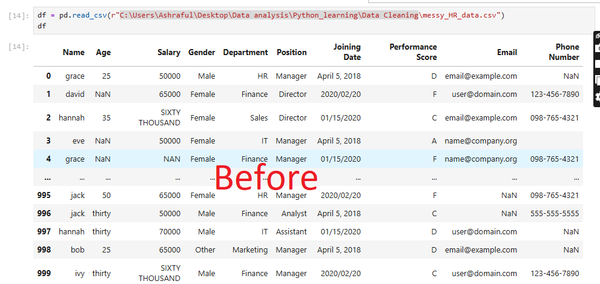

# data-cleaning-pandas-project

# Data Cleaning Project using Pandas

##  Overview

This project demonstrates a complete data cleaning workflow using Python.
The dataset contained multiple real-world issues such as missing values, inconsistent formats, and mixed data types.

The goal was to transform raw, messy data into a clean and structured dataset ready for analysis.

---

##  Dataset Issues

The original dataset had the following problems:

* Missing values in **Age, Salary, and Email**
* Salary values in mixed formats (e.g., `"500"`, `"four hundred"`)
* Inconsistent date formats (e.g., `"April 5, 2018"`, `"22/05/2022"`, `"03-25-2019"`)
* Name column with improper capitalization
* Extra spaces and formatting inconsistencies

---

##  Data Cleaning Steps

### 1. Handling Missing Values

* Filled numeric columns (Age, Salary) using **median**
* Filled text columns (Email) with `"unknown"` or removed rows where necessary

### 2. Salary Standardization

* Converted text values (e.g., `"four hundred"`) into numeric format
* Removed symbols and non-numeric characters

### 3. Date Formatting

* Standardized multiple date formats into a single format (`YYYY-MM-DD`)
* Handled both **DD/MM/YYYY** and **MM/DD/YYYY**

### 4. Text Cleaning

* Fixed capitalization in name column
* Removed unnecessary spaces

### 5. Column Management

* Created cleaned columns
* Removed original uncleaned columns after validation

---

##  Before vs After

| Issue Type    | Before Example | After Example |
| ------------- | -------------- | ------------- |
| Salary        | "four hundred" | 400           |
| Date          | "03-25-2019"   | 2019-03-25    |
| Name          | "john doe"     | John Doe      |
| Missing Email | NaN            | unknown       |

---

##  Basic Insights

After cleaning:

* Dataset is consistent and analysis-ready
* Numeric columns can now be used for statistical analysis
* Dates are standardized for time-based analysis

---

## 🚀 Tools Used

* Python
* Pandas
* Jupyter Notebook

## 🎯 Conclusion

This project highlights the importance of data cleaning as a crucial step before analysis.
Proper cleaning ensures accuracy, consistency, and reliability of insights.

---

## 🔗 Author

**Kayoum Biswas**
